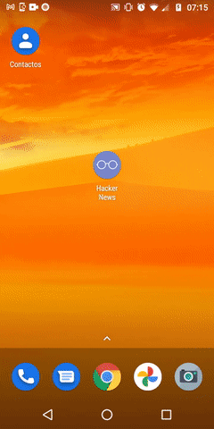
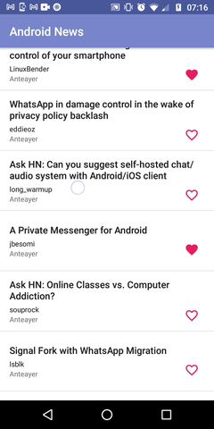

# Hacker News (Android)
Offline first Android App using Clean Architecture, MVVM, ViewBinding, Paging, Koin, Coroutines, LiveData, Room, and AndroidX. 
The data is fetched from <a href='https://hn.algolia.com/'>Search Hacker News</a>. 

  <i>*Data from <a href='https://hn.algolia.com/'>Search Hacker News</a></i> 

## Libraries and tools used in the project

### Android

* [AndroidX](https://developer.android.com/jetpack/androidx)
Artifacts within the androidx namespace comprise the Android Jetpack libraries. Like the Support Library, 
libraries in theandroidx namespace ship separately from the Android platform and provide backward compatibility 
across Android releases.
* [View Binding](https://developer.android.com/topic/libraries/view-binding)
View binding is a feature that allows you to more easily write code that interacts with views. Once view binding is enabled in a module, it generates a binding class for each XML layout file present in that module.
* [Android KTX](https://github.com/android/android-ktx)
A set of Kotlin extensions for Android app development.

### Architecture and Design

* [Android Architecture Components](https://developer.android.com/topic/libraries/architecture/index.html)
Android architecture components are a collection of libraries that help you design robust, testable, and maintainable apps. 
Start with classes for managing your UI component lifecycle and handling data persistence.
* [Paging Library](https://developer.android.com/topic/libraries/architecture/paging)
The Paging Library helps you load and display small chunks of data at a time. Loading partial data on demand reduces usage of network bandwidth and system resources.
* [Koin](https://insert-koin.io/)
A pragmatic lightweight dependency injection framework for Kotlin developers. Written in pure Kotlin using functional 
resolution only: no proxy, no code generation, no reflection!
* [Coroutines](https://kotlinlang.org/docs/reference/coroutines-overview.html)
Asynchronous or non-blocking programming is the new reality. Whether we're creating server-side, desktop or mobile applications, 
it's important that we provide an experience that is not only fluid from the user's perspective, but scalable when needed.

### View and Animation

* [ConstraintLayout](https://developer.android.com/training/constraint-layout/index.html)
Allows you to create large and complex layouts with a flat view hierarchy (no nested view groups).
* [RecyclerView](http://developer.android.com/reference/android/support/v7/widget/RecyclerView.html)
A flexible view for providing a limited window into a large data set.
* [Lottie](https://airbnb.design/lottie/)
Easily add high-quality animation to any native app.

### Data Request

* [Retrofit](http://square.github.io/retrofit/)
A type-safe HTTP client for Android and Java.
* [OkHttp](http://square.github.io/okhttp/)
An HTTP & HTTP/2 client for Android and Java applications.

### Persistence

* [Room](https://developer.android.com/topic/libraries/architecture/room.html)
The Room persistence library provides an abstraction layer over SQLite to allow fluent database access while harnessing the full power of SQLite.

### Others technologies & methodologies which used:
* [Gradle Kotlin DSL](https://docs.gradle.org/current/userguide/kotlin_dsl.html)
Gradle’s Kotlin DSL provides an alternative syntax to the traditional Groovy DSL with an enhanced editing experience in supported IDEs, with superior content assist, 
refactoring, documentation, and more. This chapter provides details of the main Kotlin DSL constructs and how to use it to interact with the Gradle API.
